# Procesverslag
Markdown is een simpele manier om HTML te schrijven.  
Markdown cheat cheet: [Hulp bij het schrijven van Markdown](https://github.com/adam-p/markdown-here/wiki/Markdown-Cheatsheet).

Nb. De standaardstructuur en de spartaanse opmaak van de README.md zijn helemaal prima. Het gaat om de inhoud van je procesverslag. Besteedt de tijd voor pracht en praal aan je website.

Nb. Door *open* toe te voegen aan een *details* element kun je deze standaard open zetten. Fijn om dat steeds voor de relevante stuk(ken) te doen.

## Jij

### Ontwerper:
Stephanie de Vilder

#### Je startniveau:
Mijn startniveau is: Blauw

# Je plan

  
De eerste versie/schets van je ontwerp & je persoonlijke uitdaging

  ### De eerste versie/schets:

  #### Idee 1
  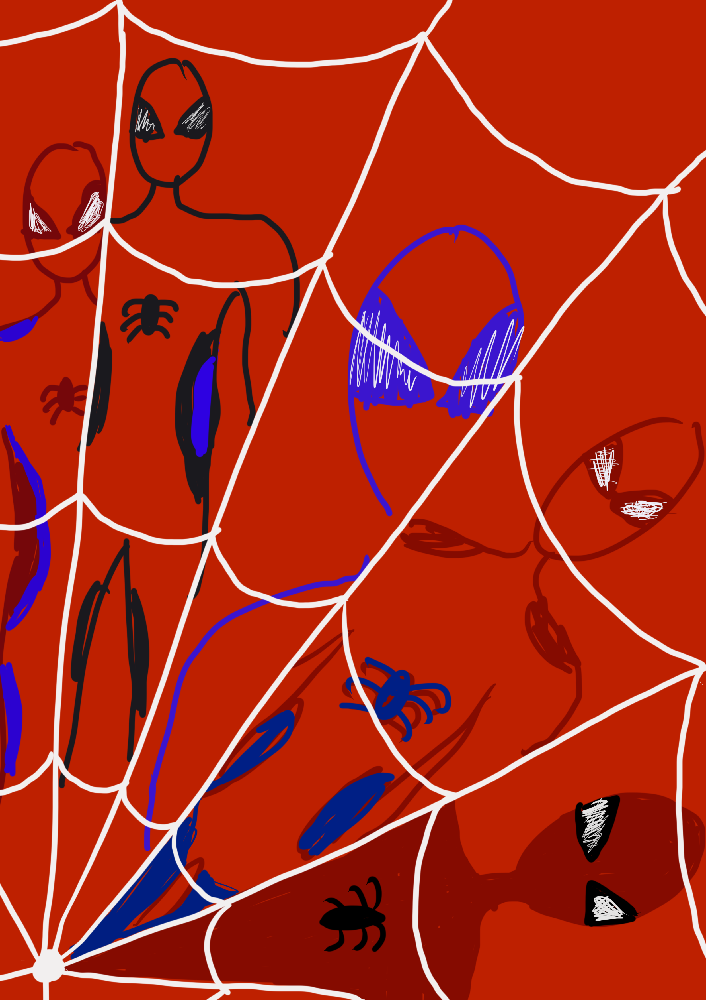
  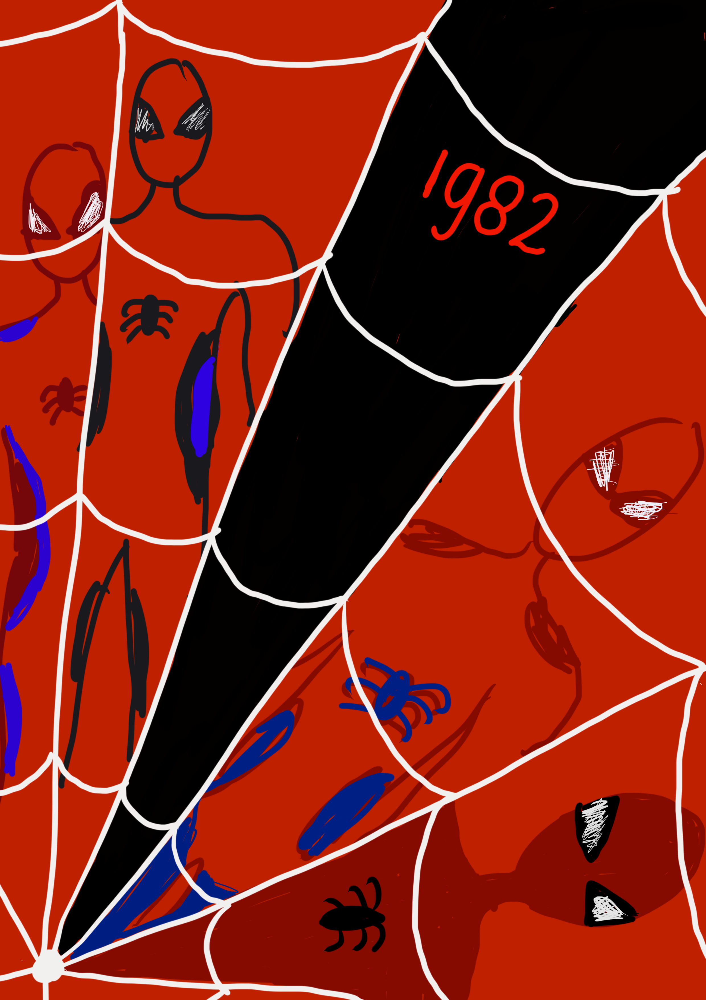
  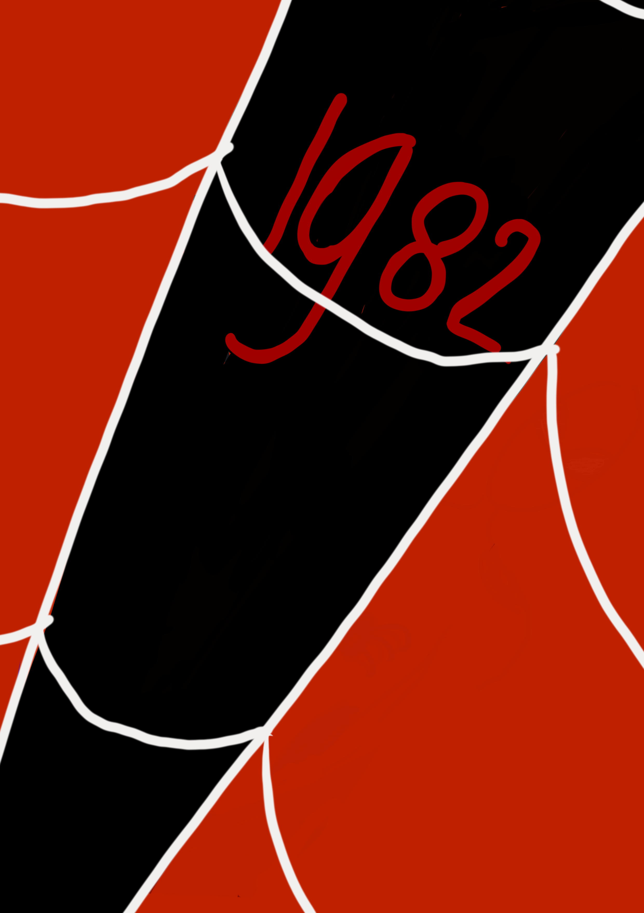
  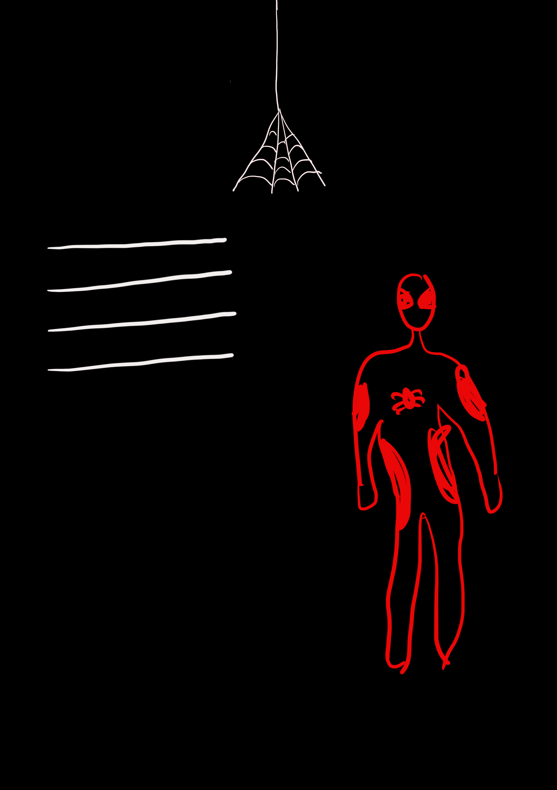
 
  Mijn eerste idee was om een web te maken met op elke rij een andere spider-man. Elke spider-man leidt je naar een nieuwe pagina met daarop de details en leuke animaties.

  ### Je ambitie: 
  Aan deze technieken/punten wil ik werken:
  - Kennis van JavaScript op frissen.
  - Elementen goed kunnen positioneren (door bijv grid en flex). 
  - Animaties doormiddel van JavaScript. 
  
 

## Voortgang/Feedback 1

  
Mijn bevindingen + wijzigingen (minimaal 5)

  ### Bevinding 1:
  Het eerste idee dat ik had bevatte meerdere pagina's (zie hierboven). Ik hoorde de dag erna dat dit niet mocht dus besloot ik eerst de andere pagina's te schappen en afbeeldingen in de pizza punten om te draaien en hier op de informatie te laten zien. Na andere bevindingen (zie bevinding 2 & 3) heb ik ervoor gekozen het idee helemaal te veranderen.

  #### oplossing:
  Als oplossing op de meerdere pagina's heb ik een pagina gemaakt waarbij de buttons na het klikken animeren en de details/informatie laat zien.

  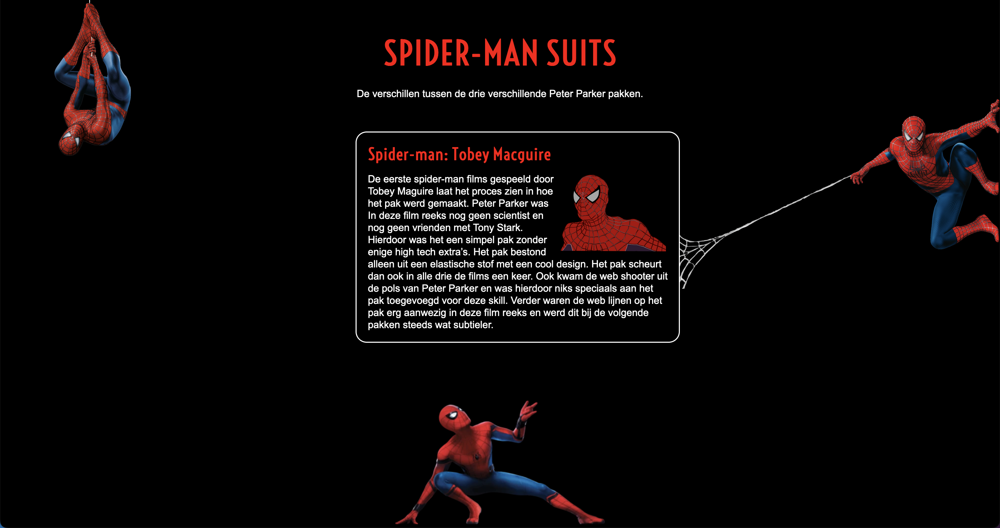

  ### Bevinding 2:
  Mijn eerste idee had weinig interacties en animaties, namelijk alleen het omdraaien van van een afbeelding.
  
  
  

  #### oplossing:
  Met mijn nieuwe concept heb ik de afbeeldingen als kleine losse buttons gemaakt die leuk kunnen animeren. Doordat ze los van elkaar staan kunnen ze vrij bewegen en eigen persoonlijkheden geven.
  
  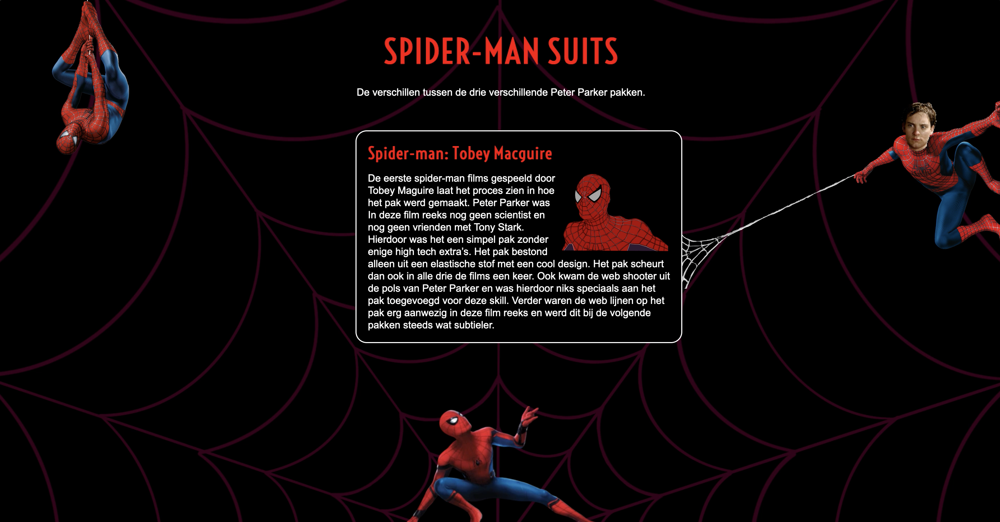
  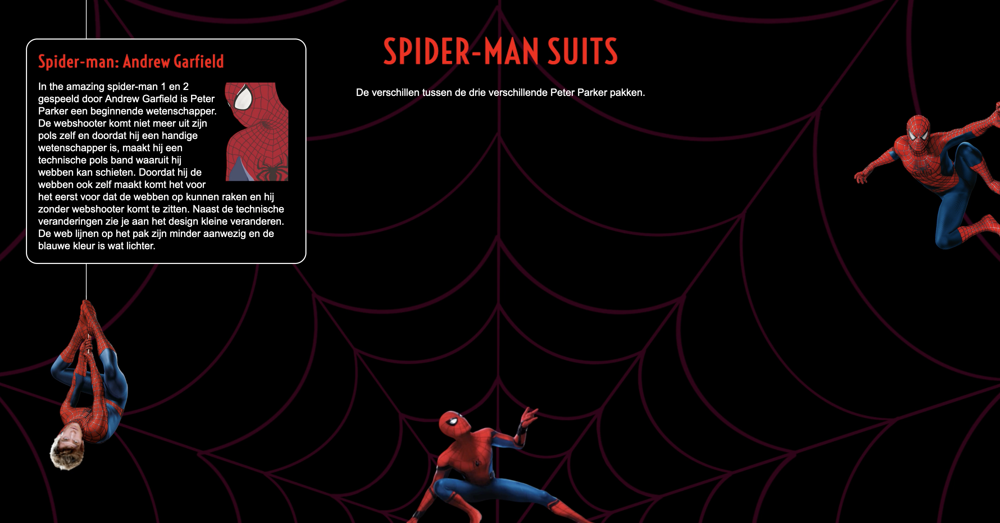
  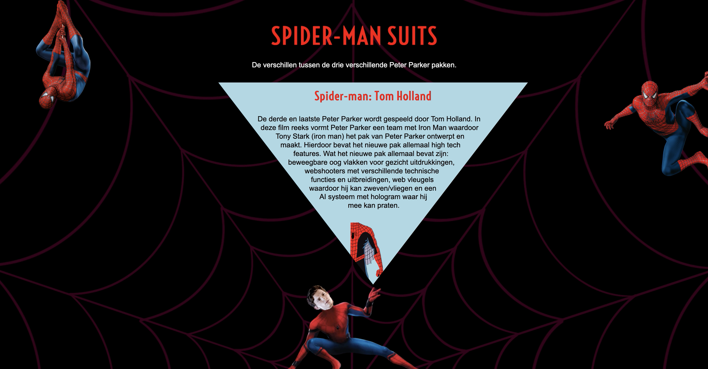

  ### Bevinding 3:
  Het eerste concept leek me erg lastig omdat ik de plaatjes in een soort pizzapunten naast elkaar zou moeten zetten. Ik heb hier een paar uur naar zitten zoeken en een oplossing voor proberen te vinden maar mijn conclusie was uiteindellijk dat ik het concept zou moeten gaan versimpelen.

  #### oplossing:
  Ik heb er voor gekozen niet de hele pagina te gebruiken als klikbare buttons maar kleinere losse buttons die verplaats zijn over het scherm. Hierdoor heb ik meer speling en ruimte voor beweging. Ook leek dit concept me iets makkelijker om mee te beginnen en ik zou altijd meer extra's kunnen toevoegen.

## Voortgang/Feedback 2

  
Mijn bevindingen + wijzigingen (minimaal 5)

  ### Feedback formulier ###
  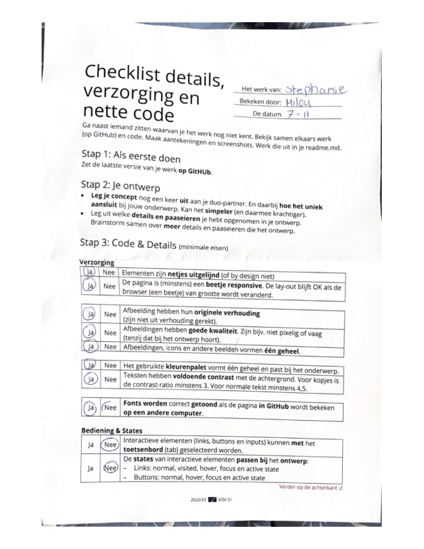
  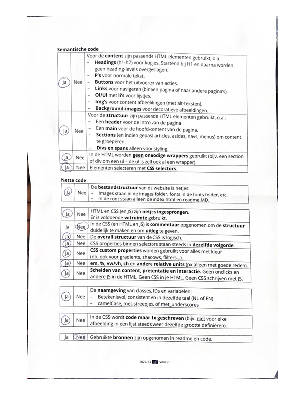
  
  ### Bevinding 1:
  De interactieve elementen zoals links en buttons konden nog niet met het toetsenbord geselecteerd worden Dit kwam omdat ik de knoppen nog als img had staan in de html.

  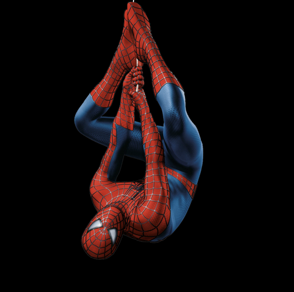

  #### oplossing:
  Ik heb dit opgelost door de imgages in een button tag te zetten. Nu kan je via de tab functie op je toetsenbord de button aanslaan.

  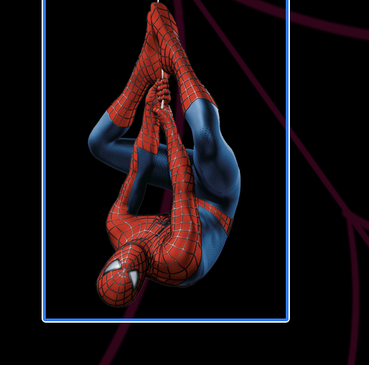

  ### Bevinding 2:
  De states van mijn buttons (hover, active focus etc.) missen nog.

  #### oplossing:
  Ik heb nog geen states toegevoegd maar ik heb wel de cursor aangepast waardoor de gebruiker wel feedback krijgt wanneer hij/zij over de button 'hovert'. 

  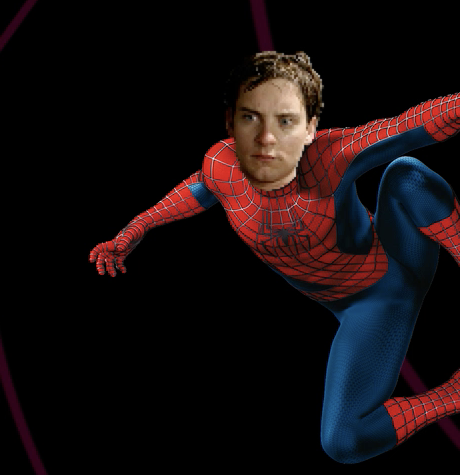
  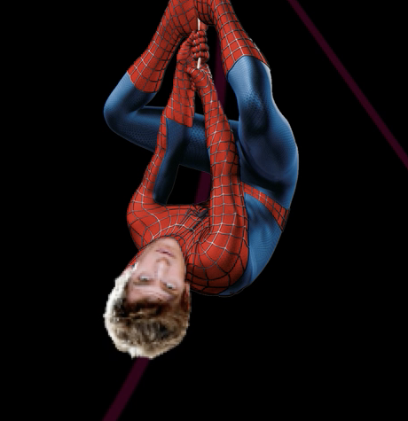
  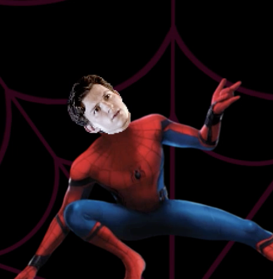

  ### Bevinding 3:
  Ik kreeg te horen van Milou dat mijn comentaar in de css nog iets duidelijker en groter mocht zodat het nog overzichtelijker wordt. 

  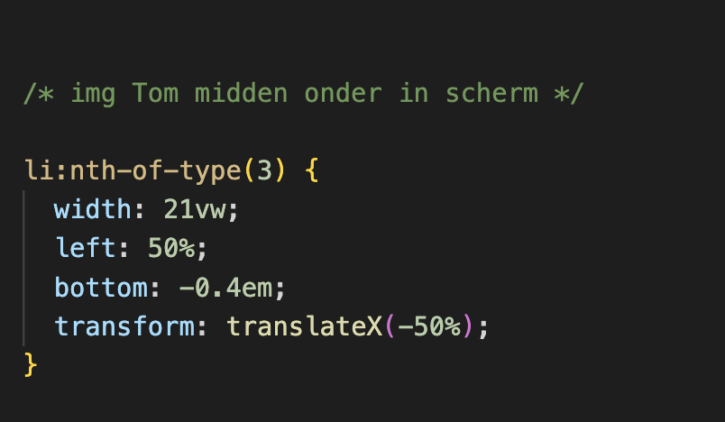

  #### oplossing:
  Ik heb de comentaar groter en duidelijker gemaakt door meer steretjes en meer regels toe te voegen.

  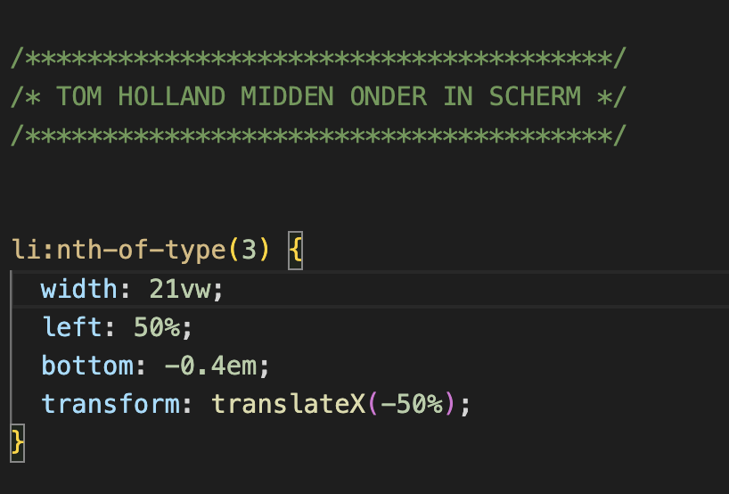

  ### Bevinding 4:
  Tijdens de feedback kwamen we erachter dat mijn bronnen ook nog niet in github stonden. Dit kwam omdat ik ze in mijn notities bij hield.

  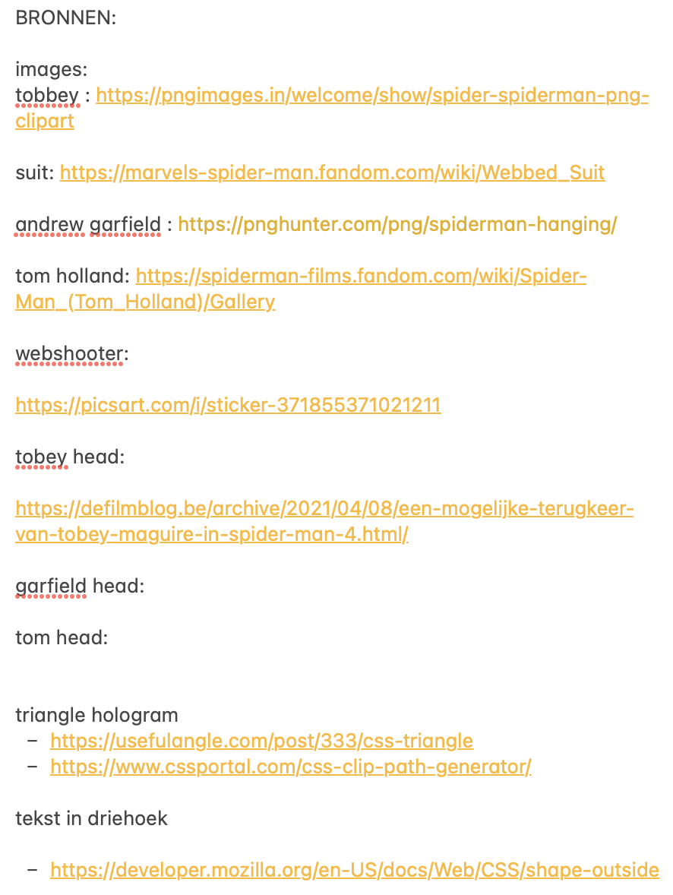

  #### oplossing:
  Ik heb de bronnen in mijn bronnenlijst gezet. Zie onderaan de pagina.

  ### Bevinding 5:
  Milou vertelde me dat de title van de website wat groter mocht omdat hij vrij klein was
  kopjes/titel mogen wat groter

  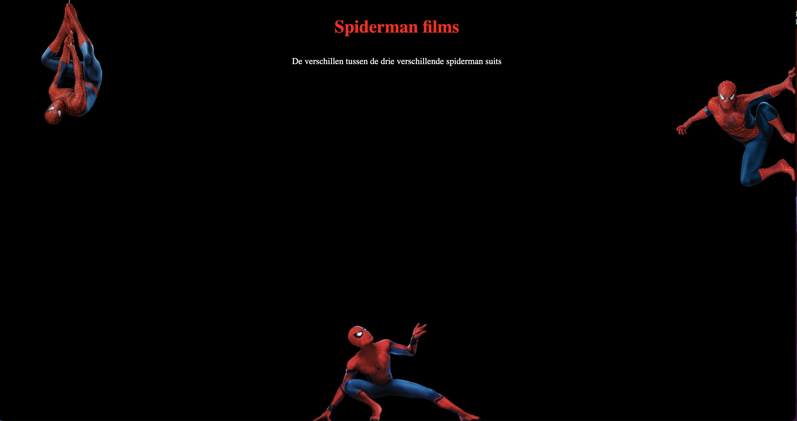

  #### oplossing:
  Ik heb de titel iets groter gemaakt en heb het font veranderd omdat ik dat nog niet had gedaan

  

## Voortgang/Feedback 3

  
Mijn bevindingen + wijzigingen (minimaal 5)

  
  ### Bevinding 1:
  In de laatste paar dagen en bij mijn derde feedback gesprek ben ik nog een paar bevindingen tegengekomen.
  De eerste daarvan is de states.
  Ik heb door gebrek aan tijd niet echt states kunnen toevoegen. Ik heb alleen een soort hover state die gecreert is door de cursur maar dit is niet een echte state. 

  #### oplossing:
  Ik zou dit hebben opgelost door : ...button:hover { box-shadow: 1em red; } aan de buttons toe te voegen bijvoorbeeld.
  

  ### Bevinding 2:
  Door gebrek aan tijd heb ik helaas ook geen dark/light mode kunnen maken. 

  #### oplossing:
  Mijn website heeft al een donkere dark mode stijl waardoor ik een light mode zou maken. Dit zou ik doen met css custom properties

  ### Bevinding 3:
  Als ik meer tijd zou hebben zou ik gaan uitvogelen hoe ik de info blokjes niet over elkaar zou laten vallen.
  
  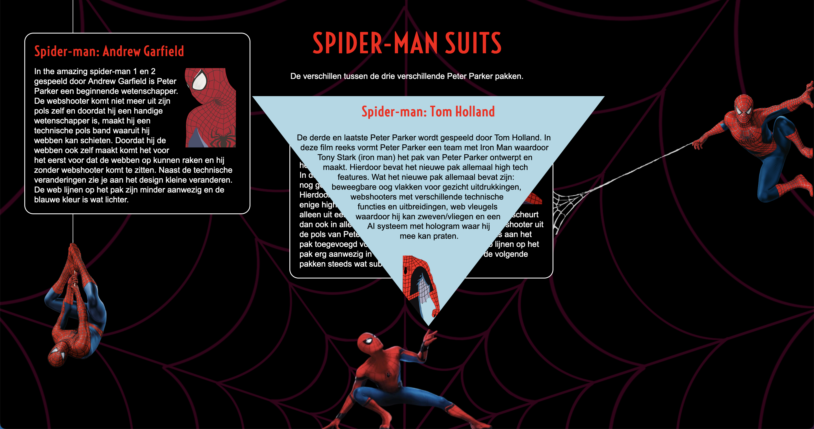

  #### oplossing:
  Ik zou dit kunnen doen door het info blokje van Tobey onder hem te plaatsen inplaats van naast hem. Hierdoor zou de hologram van Tom hier niet over vallen. 
  Ik zou ook kunnen zoeken hoe als ik op de ene button klik de andere wordt uit gezet.

### Bevinding 4:
  Ik zou het leuk vinden om een easter egg toe te voegen als ik meer tijd had.

  #### oplossing:
  Ik dacht eraan om een spinnetje toe te voegen ergens in het scherm. Wanneer je hier op zou klikken zou hij over het scherm kruipen.

  ### Bevinding 5:
  Isabel vertelde in het derde feedback gesprek dat het een leuke extra zou zijn om een geluidje toe te voegen. Zij had dit namelijk ook en dat was inderdaad leuk.

  #### oplossing:

  Ik zou het spinnetje van de easter egg een geluidje kunnen geven wanneer hij over het beeld kruipt. Of wanneer je over de verschillende spider-mans hovert de stem van de verschillende acteurs kunnen laten horen. Of bij de animaties geluidjes laten horen. Bijvoorbeeld het web dat schiet of een geluid van een draad dat langzaam naar beneden zakt. 

  

## Reflectie

  
Mijn eindresultaat & persoonlijke ontwikkeling

  ### Je uitkomst - karakteristiek screenshot(s):
  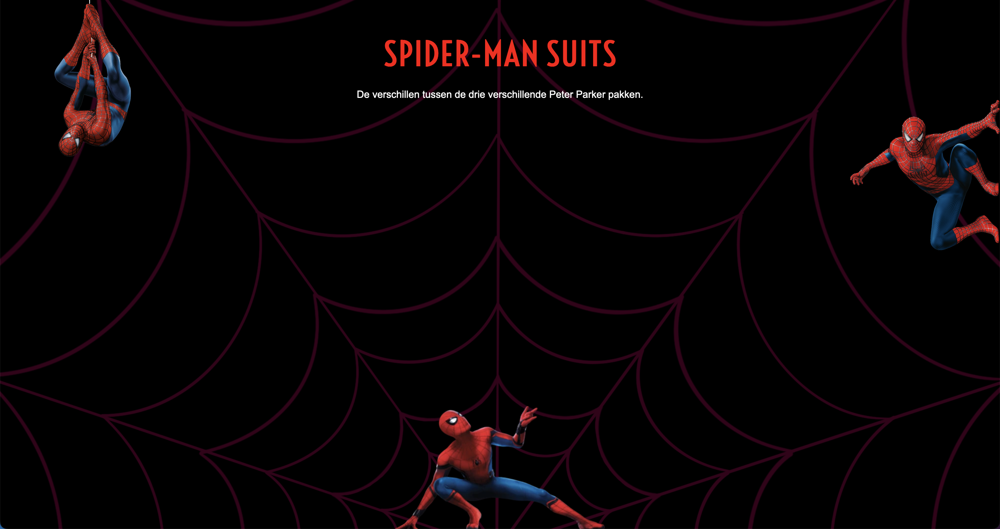
  
  
  
  
  

  ### Dit ging goed/Heb ik geleerd: 
  Ik ben uiteindelijk wel tevreden met wat ik heb opgeleverd. Ik vind het er mooi uitzien en vind de animaties en cursors erg leuk. 

   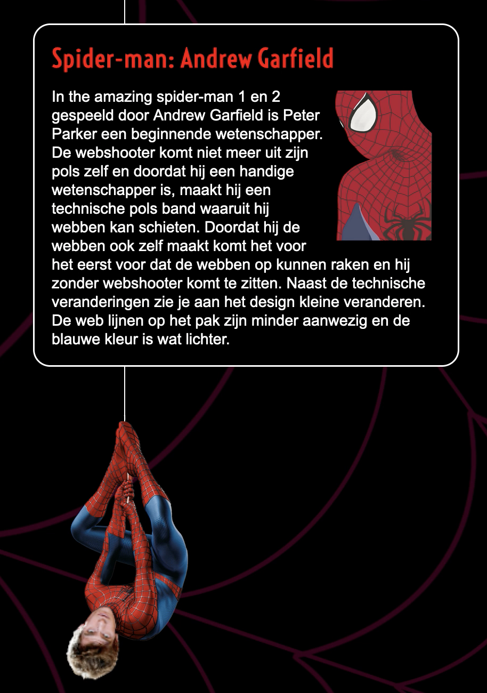

  Ik merkte dat de css best goed ging en ik daar niet te veel hulp bij nodig had, behalve de bijzondere stukjes die ik nooit eerder had gedaan zoals een tekst in de vorm van een driehoek weergeven of bijvoorbeeld hoe ik het spinnenweb aan het info blokje bij Tobey kon laten "plakken". 

  Ook heb ik mijn JavaScript weer goed opgefrist. Na een beetje uitleg en een voorbeeld kon ik de basic JavaScript zelf schrijven omdat nog kon herineren van het eerste en tweede jaar. Wanneer ik hulp kreeg bij JavaScript stukjes (zoals hoe ik twee funtions kan toevoegen op 1 button) begreep ik het ook meteen en kan ik het nu zelf toepassen.

  ### Dit was lastig/Is niet gelukt:
  Ik vond het best lastig om in de opdracht te komen. Ik was erg lang bezig met het concept en ik vond eigenlijk niks goed en ik maakte het mezelf hierdoor erg lastig. Tijdens de derde les kon ik pas echt beginnen met code schrijven en dit heeft me veel tijd gekost wat ik erg jammer vond. Ik moet wel vaker even in komen bij een vak/opdracht en vind het lastig dat deze vakken allemaal zo kort duren omdat ik er pas juist plezier ik heb bij de laatste week. 

 

  Als ik iets meer tijd had had dit nog willen toevoegen/aanpassen:
  - States toevoegen
  - Dark/Light mode toevoegen
  - De informatie blokken zo maken dat ze niet over elkaar heen komen.
  - Easter egg toevoegen (spinnetje over het scherm)
  - Geluidje toevoegen
  

## Bronnenlijst

continu bijhouden terwijl je werkt

#### Afbeeldingen
1. Tobey button : https://pngimages.in/welcome/show/spider-spiderman-png-clipart 
2. Garfield button : https://pnghunter.com/png/spiderman-hanging/ 
3. Tom button : https://spiderman-films.fandom.com/wiki/Spider-Man_(Tom_Holland)/Gallery 
4. Tobey hoofd voor cursor : https://defilmblog.be/archive/2021/04/08/een-mogelijke-terugkeer-van-tobey-maguire-in-spider-man-4.html/  
5. Garfield hoofd voor cursor : https://www.indiewire.com/2021/09/andrew-garfield-fought-sony-amy-pascal-spider-man-1234663221/
6. Tom hoofd voor cursor : https://www.rtlnieuws.nl/nieuws/buitenland/artikel/5326800/tom-holland-spiderman-instagram-sociale-media-mentale-gezondheid 
7. Spinnenweb die schiet : https://picsart.com/i/sticker-371855371021211  

- De rest is door mij getekend.

#### Informatie tekten
1. Info over de verschillende spidermans : https://www.sideshow.com/blog/mcu-spider-man-different-powers-personalities
2. Info over de verschillende spidermans : https://blog.finaldraft.com/the-evolution-of-peter-parker-how-spider-man-has-changed-over-the-last-20-years  
3. Info over Tom holland's pak : https://www.cbr.com/spider-man-homecoming-suit-secrets/  
4. Info over Tobey, Garfield en Tom pak : https://therealstanlee.com/pop-culture/the-evolution-of-spider-mans-movie-suits/ 

#### Hulp met Css & JS
1. Driehoek hologram : https://usefulangle.com/post/333/css-triangle   +  https://www.cssportal.com/css-clip-path-generator/  
2. Tekst in vorm van driehoek : https://developer.mozilla.org/en-US/docs/Web/CSS/shape-outside  
3. Delay in JS (tekstblok van Tobey) : - https://developer.mozilla.org/en-US/docs/Web/API/setTimeout 

